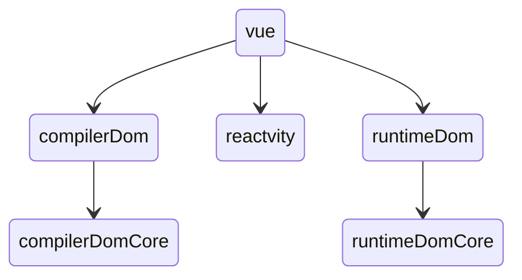

## 1.我们为什么学源码
- 装13
- 内卷应付面试
- 加深理解
- 增强解决问题能力
- 掌握真正傍身技能
## 2.源码学习方法分享
- 找到一条主线
- 画一张思维导图
- 提出一个问题，去源码中找答案
- 造一个轮子
- 费曼学习法
## 3.搭建源码学习环境
```shell
 git clone git@github.com:vuejs/core.git 
pnpm install
# 在 package.json 上加 --sourcemap
pnpm  dev
# server
pnpm serve
```
#### 打开/packages/vue/examples/composition/todomvc 
- 打开开发者工具source
- cmd+P  打断点 createApp
- 找源文件 右键 reveal in sidebar
## 4、项目结构
- rollup 进行打包  jest进行单元测试 eslint进行代码质量管控  Ts进行编写  pretty进行代码格式化



 ## 5、vue初始化(学习方法：1、调试法 2、查看调用栈)
 
 -  new Vue().createApp.mount()
 
 - mount函数： 创建vNode，patch函数转化成真实dom挂载到根Dom节点上（#app）
 - patch函数： setupComponent挂载render函数， 递归生成真实dom树
 
 - 挂载流程图
 
 
 
 