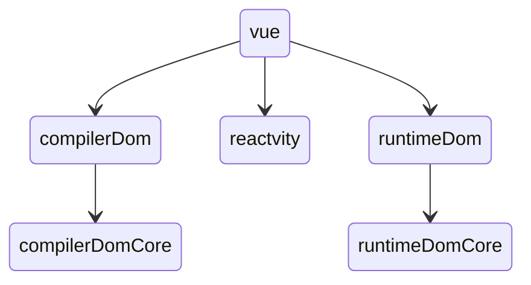

# Vue3 源码分析

## 1.我们为什么学源码

- 装 13
- 内卷应付面试
- 加深理解
- 增强解决问题能力
- 掌握真正傍身技能

## 2.源码学习方法分享

- 找到一条主线
- 画一张思维导图
- 提出一个问题，去源码中找答案
- 造一个轮子
- 费曼学习法

## 3.搭建源码学习环境

```shell
 git clone git@github.com:vuejs/core.git
pnpm install
# 在 package.json 上加 --sourcemap
pnpm  dev
# server
pnpm serve
```

#### 打开/packages/vue/examples/composition/todomvc

- 打开开发者工具 source
- cmd+P 打断点 createApp
- 找源文件 右键 reveal in sidebar

## 4、项目结构

- rollup 进行打包 jest 进行单元测试 eslint 进行代码质量管控 Ts 进行编写 pretty 进行代码格式化



## 5、vue 初始化(学习方法：1、调试法 2、查看调用栈)

- new Vue().createApp.mount()
  
- mount 函数： 创建 vNode，patch 函数转化成真实 dom 挂载到根 Dom 节点上（#app）
- patch 函数： setupComponent 挂载 render 函数， 递归生成真实 dom 树
  
- 挂载流程图


## 总结： vue3 变化情况

- 函数式创建实例： 1、Ts 强类型的支持 2、避免构造函数污染 3、api 的简化，一致性增强 4、有利于 treeshaking

## 6、更新流程分析

- setupRenderEffect 建立更新机制
- 组件数据发生变化执行更新机制
- 内部调用 dipatch
  

### 代码分析

- setupRenderEffect()
- queueJob()
- queueFlush()
- -----以下为 async 代码---
- flushJob()
- run()
- componentUpdatefn
- patch
  

# 7、composition Api 探究

- 1、setup 的执行时机，为什么没有 crate 钩子
- 在 setup 执行后调用 applyOptions(instance)处理 vue2 的 optong 选项

```javascript
// support for 2.x options
if (__FEATURE_OPTIONS_API__ && !(__COMPAT__ && skipOptions)) {
  setCurrentInstance(instance);
  pauseTracking();
  applyOptions(instance);
  resetTracking();
  unsetCurrentInstance();
}
```

- 2、传入 setup 函数的参数 props 和 ctx，它们来自哪里？

```javascript
const setupResult = callWithErrorHandling(
  setup,
  instance,
  ErrorCodes.SETUP_FUNCTION,
  // 传入setup 函数参数 props, ctx
  [__DEV__ ? shallowReadonly(instance.props) : instance.props, setupContext]
);
// setupContext
// 返回上下文
setupContext = {
  get attrs() {
    return attrs || (attrs = createAttrsProxy(instance));
  },
  slots: instance.slots,
  emit: instance.emit,
  expose,
};
// setup可以传入参数props, {attr, slots, emit, expose}
```

- 3、如果和 data 冲突，它们共存吗，vue3 怎么处理？
- 先处理 setup 的数据，接着时 data，context...。数据可以共存

```javascript
if (n !== undefined) {
        switch (n) {
          case AccessTypes.SETUP:
            return setupState[key]
          case AccessTypes.DATA:
            return data[key]
          case AccessTypes.CONTEXT:
            return ctx[key]
          case AccessTypes.PROPS:
            return props![key]
          // default: just fallthrough
        }
}
```

- 4、多个生命周期函数是如何工作的
- 利用 hook 数组将生命周期函数 push，

```javascript
hooks.push(wrappedHook);
```

- 5、 provide/inject 如何实现？
- 组件实例化时 provide 指向父组件， 通过原型链继承实现祖先/子组件传值

```javascript
 let provides = currentInstance.provides
 // by default an instance inherits its parent's provides object
 // but when it needs to provide values of its own, it creates its
 // own provides object using parent provides object as prototype.
 // this way in `inject` we can simply look up injections from direct
 // parent and let the prototype chain do the work.
 const parentProvides =
   currentInstance.parent && currentInstance.parent.provides
 if (parentProvides === provides) {
   provides = currentInstance.provides = Object.create(parentProvides)
 }
 // TS doesn't allow symbol as index type
 provides[key as string] = value
```

- 6、 getCurrentInstance 如何实现？
- 直接返回

```javascript
export const getCurrentInstance: () => ComponentInternalInstance | null = () =>
  currentInstance || currentRenderingInstance;
```

# 7、 响应式原理

- 1、 ref 为什么使用时需要加 value
- 2、 wathc 如何实现
- 3、 computed 怎么实现

### reactive 函数实现原理
